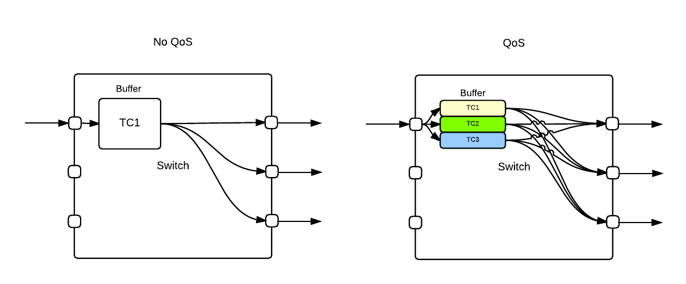

## SR-IOV

SR-IOV 是 I/O 虚拟化的一种，用来实现 PCI 设备的虚拟化，并不是 Mellanox 独创的技术。SR-IOV 技术让多个 VM 可以共用一个 PCI 设备，与之相对的 MR-IOV 是让多个 VM 共用多个可能在不同物理机器上的 PCI 接口。有了这项技术才能在 VM 中使用 RDMA。配置使用 SR-IOV 需要：
- 宿主机中安装配置 Mellanox OFED
- VM 配置 Mellanox PCI 设备
- VM 中安装对应的驱动
具体配置方法在 [Mellanox User Manual](http://www.mellanox.com/related-docs/prod_software/Mellanox_OFED_Linux_User_Manual_v4_4.pdf)

## Mellanox QoS

- Quality of service (QoS) refers to any technology that manages data traffic to reduce packet loss, latency and jitter on the network.



将流量分成不同的 TC (Traffic Class) 用来进行不同的限速和优先级调度。

- TC: Traffic Class: a group of all flows that receive the same service characteristics (e.g. buffer size, scheduling). It is possible that some flow with different priorities will be mapped to the same traffic class.

传统的 TCP/IP 网络使用 IP 头的 TOS/DSCP 段进行限速，需要把它们映射到 TC 进行限速，对应的映射关系可以用
```
mlnx_qos -i <device>
```

进行查看。

## 各种工具的配置使用方法

Mellanox Community 上有一篇 Blog  [HowTo Configure RoCE on ConnectX-4](https://community.mellanox.com/s/article/howto-configure-roce-on-connectx-4) 讲如何配置映射和使用 RoCE v2 使用 ib_send_bw 进行测试。

mlnx_qos 的使用方法 [mlnx_qos manual](https://community.mellanox.com/s/article/mlnx-qos)

[Mellanox ASAP2](https://community.mellanox.com/s/article/getting-started-with-mellanox-asap-2) 在 VM 中取代 Open vSwitch，还没有自己验证过。

libvirt 和 qemu 管理配置虚拟机的方法。[libvirt](https://access.redhat.com/documentation/en-us/red_hat_enterprise_linux/5/html/virtualization/sect-virtualization-adding_a_pci_device_to_a_host)

